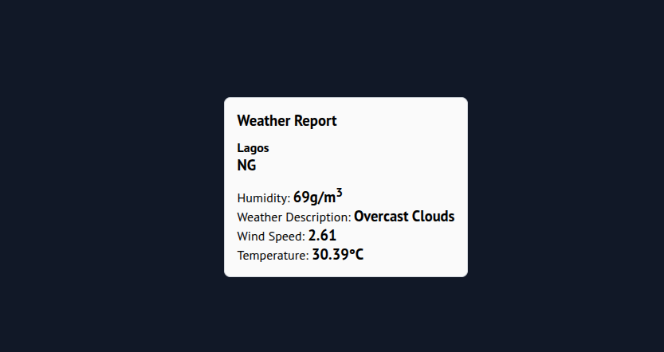

# Making API Calls

<v-clicks>

- **APIs:** Application Programming Interfaces that allow our code to interact with external services
- **Used for:** Fetching data, sending data, integrating services
- **Project example:** Weather dashboard using OpenWeatherMap API

</v-clicks>

::right::

```js {all|1-5|7-13|all}
// Basic fetch example
fetch('https://api.example.com/data')
  .then(response => response.json())
  .then(data => console.log(data))
  .catch(error => console.error('Error:', error));

// From our weather app
async function getWeatherData(city) {
  const apiKey = 'your-api-key';
  const url = `https://api.openweathermap.org/data/2.5/weather?q=${city}&appid=${apiKey}&units=metric`;
  const response = await fetch(url);
  return await response.json();
}
```

<div class="mt-4">
  
</div>