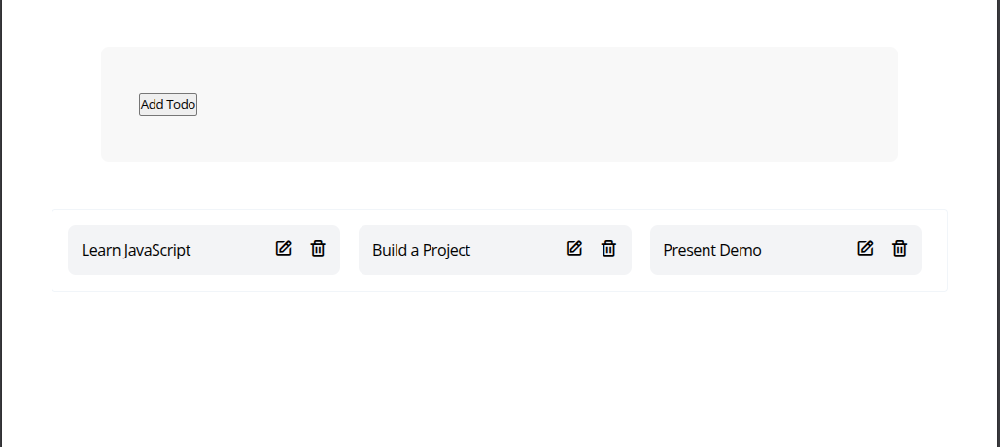

# Arrays

<v-clicks>

- **What are arrays?** Ordered collections of data
- **Common operations:** Accessing elements, looping, manipulating
- **Project example:** To-do list application

</v-clicks>

::right::

```js {all|1-2|4-6|8-10|all}
// Creating arrays
const tasks = ['Learn JavaScript', 'Build a project', 'Present work'];

// Accessing and looping
tasks.forEach((task, index) => {
  console.log(`Task ${index + 1}: ${task}`);
});

// Array methods we used
const completedTasks = tasks.filter(task => task.isCompleted);
const taskNames = tasks.map(task => task.name);
```

<br>
